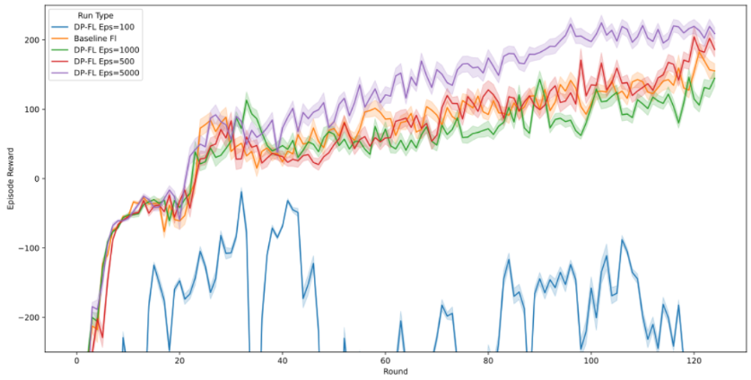
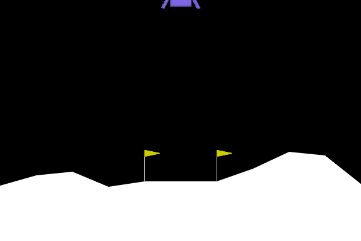

# FedLander (in progress)

Federated Reinforcement Learning with Differential Privacy on LunarLander

## What this is

This project trains multiple PPO agents across different "planet" environments (Moon, Earth, Mars gravity, plus wind variations) without any of them sharing raw training data with each other. Instead, each agent trains locally and only sends its *model weights* to a central server, which averages them together using FedAvg to build one global policy that works reasonably well across all the different conditions.

On top of that, I added a differential privacy layer (Laplace mechanism) on the weight updates, so you can't reverse-engineer which environment a client trained on just by looking at what it sends to the server.

Was originally built with a couple of teammates for CS 595-03 (Decentralized Machine Learning Systems) during my Master's at Illinois Institute of Technology. I'm currently rebuilding it solo - cleaner & modular code, better structure, actually documented as a project I can walk through properly, instead of just pointing to a semester group repo.

## Why I wanted to do this

The original motivation behind this project actually came from healthcare, not aerospace. Think about how ICU doctors treat sepsis: at any given moment, they look at a patient's current vitals/state and decide on a treatment action, without knowing exactly how the patient will respond, which is basically a sequential decision-making problem under uncertainty, the same structure an RL agent deals with when it's learning in an environment it doesn't fully know yet.

The catch is that hospitals can't just pool all their patient data together to train one shared model due to data regulations (like HIPAA) make sharing raw patient records across institutions a non-starter. So the real question we wanted to explore was: could federated learning let multiple hospitals collaboratively train one global "treatment policy" model, each using their own local patient data, without any raw data ever leaving their walls? And if you add differential privacy on top, could you also stop someone from reverse-engineering details about a hospital's patient population just by looking at the model updates it sends?

LunarLander ended up being our stand-in testbed for this idea. It's a sequential control problem where an agent has to make ongoing decisions based on its current state to reach a good outcome (a safe landing) similar in spirit to a treatment policy trying to steer a patient's state toward recovery, but it's a lot easier to simulate and iterate on than actual clinical data, which made it a practical way to test the FL + DP approach before ever thinking about applying it to something as sensitive as real patient data.

Most federated learning examples online focus on classification tasks (MNIST-style stuff), which felt a little too clean for this. RL felt like the more honest analogue to the healthcare problem, since it's about a sequence of decisions rather than a single prediction, and local policies can drift a lot more from each other than local classifiers do especially once you're adding privacy noise into the mix.

## Stack

- Python 3.10+
- Gymnasium (LunarLander-v3), with custom planet/gravity/wind variants
- Stable-Baselines3 (PPO) for local agent training
- NumPy

## Project Structure

```
fedlander/
├── environment/        # LunarLander with custom planet physics
├── agent/              # PPO agent wrapper
├── federated/           # FL server + client, FedAvg aggregation, DP noise
├── utils/              # privacy, logging & plotting
└── experiments/        # training scripts
```

(Some pieces above are still being rebuilt/reorganized - see Status section.)

## Setup

```
pip install -r requirements.txt
```

## Results (from original project runs)

A quick note before this section: these plots/tables are from training runs I did while working on the original version of this project. Reproducing them exactly would mean re-running 100+ federated rounds across several privacy settings, which took a good chunk of compute time on Chameleon Cloud (research infra I had access to through my university at the time), not something I can casually redo on a laptop or free-tier cloud notebook. The code itself runs fine end-to-end; I just haven't re-trained at that scale outside of that environment.

### Average client reward over training



The baseline (no privacy) model and the less-noisy DP variants (ε=500, ε=1000, ε=5000) all converge to solid, steadily improving reward over training rounds. The ε=100 setting adds so much noise that the model basically can't learn consistently & reward swings wildly and never really stabilizes. That's the privacy/utility tradeoff in a nutshell: more privacy (lower epsilon) means more noise, and at some point that noise just drowns out the actual learning signal.

### Generalization across planet/wind scenarios

![Evaluation Across Scenarios]
## Performance Comparison (Mean Reward)

| Scenario            | Baseline FL | DP eps=5000 | DP eps=500 | DP eps=100 | Single Earth | Single Mars | Single Moon |
|--------------------|------------|-------------|------------|------------|--------------|-------------|-------------|
| Earth (no wind)    | 254        | 274         | 256        | -379       | 241          | 191         | 33          |
| Earth (wind=6)     | 200        | 234         | 217        | -344       | 229          | 143         | -10         |
| Mars (wind=5)      | 248        | 249         | 241        | -541       | 155          | 188         | 141         |
| Mars (wind=8)      | 251        | 247         | 244        | -586       | 151          | 174         | 130         |
| Moon (wind=15)     | 72         | 104         | 112        | -935       | 11           | 34          | 33          |
| Moon (wind=7)      | 134        | 146         | 129        | -1115      | 55           | 57          | 102         |
| Turbulence         | 180        | 232         | 181        | -345       | 209          | 103         | -31         |
| **Average**        | **191**    | **213**     | **197**    | **-606**   | **150**      | **127**     | **57**      |

After training, I evaluated the final global policy across a bunch of scenarios (Earth, Mars, Moon, various wind levels, plus a "turbulence" stress test) and compared it against models trained on just one scenario at a time. The federated models (especially ε=500 and ε=5000) actually generalized better on average than the single-scenario models, since they'd seen a wider mix of conditions during training. Meanwhile ε=100 fell apart across every single scenario, which lines up with what the training curves show.

### Demo



## Status

Actively rebuilding this solo right now. The environment and PPO agent pieces work end-to-end; I'm still cleaning up and re-organizing the Client Privacy identification code & gradual weight adjustment mechanism from the original group project into something more modular and for my own understanding.

## Acknowledgments

This project builds on the original team repo from CS 595, maintained together with teammates: [CS595-Project-FedRL](https://github.com/henriquem27/CS595-Project-FedRL). That version went through several iterations (v1 through v5), progressively adding differential privacy, more parallel environments, and a "gradual weight adjustment" trick to stabilize training under noise, eventually landing on a setup with 21 total clients (Earth/Mars/Moon plus wind-variant derivatives) trained on Chameleon Cloud. This repo is my solo attempt to take that same core idea and rebuild it.